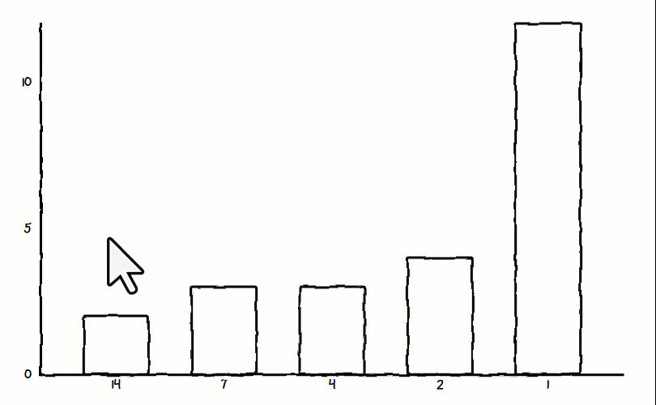
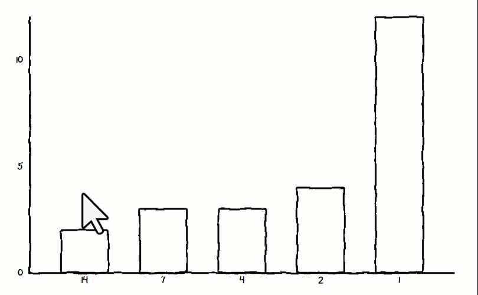

# How to customize chart colors

You can customize the colors of your charts using **HTML color names** (e.g., `red`, `blue`) or **HTML color codes** (e.g., `#FF0000`). Here's how:


**Note:** Leave the colors field empty to use default colors. Invalid entries will be ignored.


#### Example 1: One Color for All Bars/Lines/Dots

Enter `red` in the colors field.

.png>)\
Result: All bars, lines, or dots will be red.

<figure><figcaption></figcaption></figure>

***

#### Example 2: Multiple Colors

Enter `red, blue, green, yellow, #FF5733` in the colors field.

.png>)\
Result:

* 1st Element: Red
* 2nd Element: Blue
* 3rd Element: Green
* 4th Element: Yellow
* 5th Element: Orange (`#FF5733`)

<figure><figcaption></figcaption></figure>

